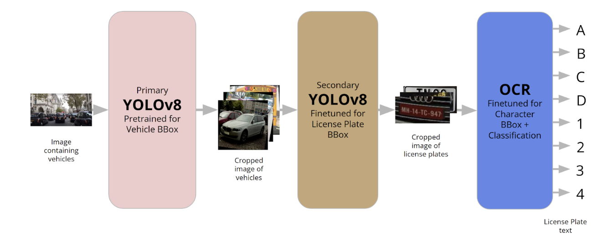

# CSE5717-Project
Project for CSE 5717: Big Data Analytics

Problem Statement:
License plate recognition is a critical application in intelligent transportation systems, with far-reaching implications for traffic management, security, and law enforcement. This project tackles the challenge of accurately detecting and classifying alphanumeric characters on license plates from vehicle images, positioning it as a classification problem within the computer vision and machine learning domains. By leveraging advanced techniques, we aim to develop a robust system capable of locating license plates, segmenting individual characters, and classifying them into their corresponding alphanumeric representations. The system's performance will be rigorously evaluated against a baseline model, employing industry-standard metrics such as character recognition accuracy, overall license plate recognition accuracy, and inference time against representative data. 

Brief Description of Model Technique: 
We started with a YOLO model that was pre-trained with the COCO dataset. The COCO dataset consists of many images of numerous objects, such as people, traffic lights, cars, phones, etc. We use this initial model to find vehicle bounding boxes in the image and crop them to remove background and noise. Using a dataset from Roboflow that displayed license plate bounding boxes, we finetuned another YOLO model to predict the location of the license plate. We then cropped this image to use as input for an OCR model.
 

We hope you enjoy our project!

- Team 1